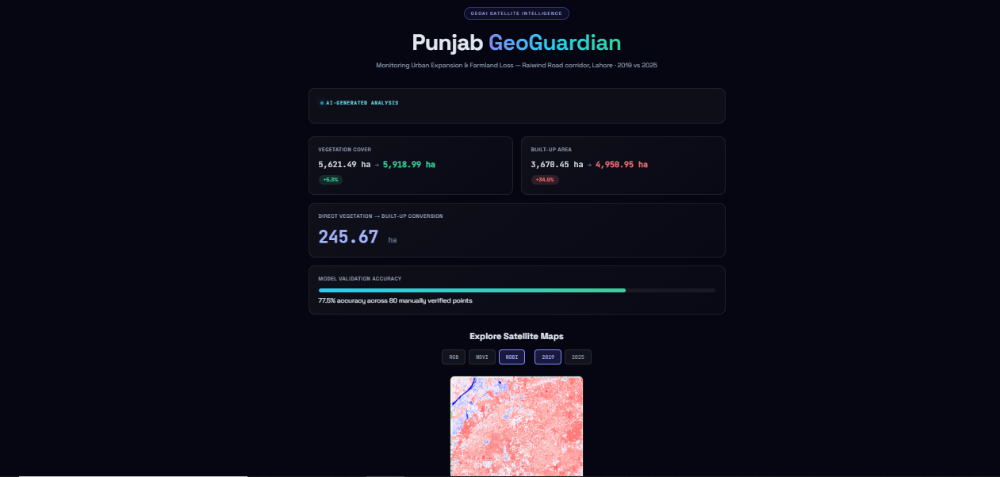
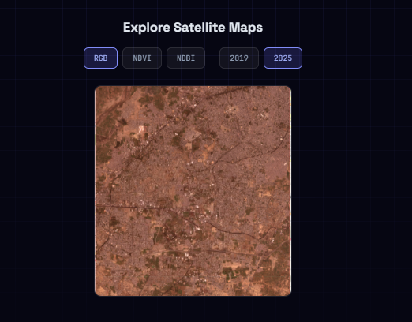

<div align="center">

# 🛰️ Punjab GeoGuardian

### AI-Based Satellite Monitoring of Urban Expansion & Farmland Loss

*AIRI Team — PITB AI Internship, Task 3 (GeoAI)*

[](https://punjab-geoguardian.vercel.app)
[](https://punjab-geoguardian.onrender.com)
[](https://www.python.org/)
[](https://fastapi.tiangolo.com/)
[](https://react.dev/)
[](https://ai.google.dev/)
[](https://earthengine.google.com/)
[](LICENSE)

**A live, public GeoAI dashboard that detects and visualizes land-use change from satellite imagery.**

[Live Demo](https://punjab-geoguardian.vercel.app) · [API Docs](https://punjab-geoguardian.onrender.com/docs) · [Report a Bug](https://github.com/alisharoz99/punjab-geoguardian/issues)

</div>

---

## 📖 Table of Contents

- [Overview](#-overview)
- [Live Demo](#-live-demo)
- [Screenshots](#-screenshots)
- [Architecture](#-architecture)
- [Tech Stack](#-tech-stack)
- [Methodology](#-methodology)
- [Results](#-results)
- [Validation & Error Analysis](#-validation--error-analysis)
- [Project Structure](#-project-structure)
- [Getting Started](#-getting-started)
- [API Reference](#-api-reference)
- [Deployment](#-deployment)
- [Known Limitations](#-known-limitations)
- [Future Improvements](#-future-improvements)
- [Important Disclaimer](#-important-disclaimer)
- [Author](#-author)

---

## 🌍 Overview

**Punjab GeoGuardian** is an end-to-end GeoAI system that detects and quantifies land-use change — specifically urban expansion and possible farmland/vegetation loss — by comparing Sentinel-2 satellite imagery across two time periods.

The project selected the **Raiwind Road peri-urban corridor, Lahore**, comparing **2019 vs 2025** — a window chosen after research confirmed this corridor experienced its most significant housing-society development during exactly this period (Al-Kabir Town, Etihad Town Phase 2, and adjacent expansions).

Unlike a purely offline analysis notebook, this project is deployed as a **live, public, interactive dashboard** — not just a static report — with a real backend API, a Gemini-powered AI narrative that re-generates on each request, and a satellite map explorer.

---

## 🚀 Live Demo

| | |
|---|---|
| **Dashboard** | [punjab-geoguardian.vercel.app](https://punjab-geoguardian.vercel.app) |
| **Backend API** | [punjab-geoguardian.onrender.com](https://punjab-geoguardian.onrender.com) |
| **Interactive API Docs** | [punjab-geoguardian.onrender.com/docs](https://punjab-geoguardian.onrender.com/docs) |

> ⚠️ The backend runs on Render's free tier, which spins down after inactivity. The **first** request after idle time may take 30–50 seconds to wake up — this is expected, not a bug.

---

## 🖼️ Screenshots

*(Add 2-3 screenshots here — dashboard hero section, the map explorer in action, and the AI-generated summary card. Save them to `Outputs/screenshots/` and reference like:)*

```markdown


```

---

## 🏗️ Architecture

```
┌─────────────────┐        HTTPS        ┌──────────────────┐
│  React Frontend  │ ──────────────────▶ │  FastAPI Backend  │
│  (Vercel)         │ ◀────────────────── │  (Render)          │
└─────────────────┘        JSON          └────────┬─────────┘
                                                      │
                                    ┌─────────────────┼─────────────────┐
                                    │                 │                 │
                              ┌─────▼─────┐   ┌───────▼──────┐  ┌───────▼───────┐
                              │  Gemini    │   │  Static Map   │  │  Precomputed   │
                              │  3.6 Flash │   │  Image Store  │  │  Results (JSON)│
                              │  (narrative)│   │  (RGB/NDVI/   │  │                │
                              │             │   │   NDBI PNGs)  │  │                │
                              └────────────┘   └───────────────┘  └────────────────┘

                        ▲
                        │  offline, one-time analysis pipeline
                        │
              ┌─────────┴──────────┐
              │  Google Colab +     │
              │  Google Earth Engine │
              │  (Sentinel-2, NDVI,  │
              │   NDBI, Random Forest│
              │   classification,    │
              │   change detection)  │
              └─────────────────────┘
```

**Design decision:** the heavy satellite processing (Earth Engine queries, Random Forest classification, change detection) runs **offline in Colab**, not on every page load. The deployed backend serves the *results* of that analysis instantly, plus generates a fresh AI narrative per request. This keeps the live app fast and free-tier-friendly, while the analysis itself remains fully reproducible via the included notebook.

---

## 🛠️ Tech Stack

| Layer | Technology |
|---|---|
| **Satellite Data** | Sentinel-2 Surface Reflectance (via Google Earth Engine) |
| **Analysis Environment** | Google Colab, `geemap` |
| **Classification** | Random Forest (`ee.Classifier.smileRandomForest`) |
| **Backend** | FastAPI, Python 3.11 |
| **AI Narrative** | Gemini 3.6 Flash (`google-genai` SDK) |
| **Frontend** | React 18, Axios |
| **Backend Hosting** | Render |
| **Frontend Hosting** | Vercel |
| **Version Control** | Git + GitHub |

---

## 🔬 Methodology

1. **Area of Interest** — Raiwind Road corridor, Lahore, selected via `ee.Geometry`
2. **Imagery collection** — Sentinel-2 SR, filtered by date range and <20% cloud cover, median composite per year
3. **Index computation** — NDVI `(NIR − Red)/(NIR + Red)` and NDBI `(SWIR − NIR)/(SWIR + NIR)` for both years
4. **Training data** — threshold-guided stratified sampling (2,000 candidate points → 210 balanced training samples across 3 classes), documented transparently as a time-constrained but standard remote-sensing technique
5. **Classification** — Random Forest (50 trees) trained on spectral bands + NDVI + NDBI, applied to both years
6. **Change detection** — pixel-wise comparison between classified 2019 and 2025 maps
7. **Area calculation** — `ee.Image.pixelArea()` reduced over the AOI per class, per year
8. **Validation** — 80 points manually cross-checked against Google Maps satellite imagery
9. **Error analysis** — 18 documented misclassification cases, grouped into recurring patterns
10. **Deployment** — results + AI narrative + map gallery served via a live FastAPI + React stack

---

## 📊 Results

| Metric | 2019 | 2025 | Net Change |
|---|---|---|---|
| Vegetation / Agriculture | 5,621.49 ha | 5,918.99 ha | +297.5 ha (+5.3%) |
| Built-up / Urban | 3,670.45 ha | 4,950.95 ha | **+1,280.5 ha (+34.9%)** |
| Other (bare/mixed land) | 12,849.87 ha | 11,271.87 ha | −1,578.0 ha |

**Direct Vegetation → Built-up conversion: 245.67 ha** — representing ~19% of total built-up growth. The remaining ~81% of new built-up land came from the "Other" (undeveloped/bare) category rather than directly displacing vegetation, suggesting a land-conserving expansion pattern in this specific corridor.

> These are estimated, model-derived figures from a threshold-trained classifier — not survey-grade measurements. See [Known Limitations](#-known-limitations).

---

## ✅ Validation & Error Analysis

- **80 points** manually verified against Google Maps satellite imagery
- **77.5% accuracy** (62/80 correct)
- **18 documented error cases** — full breakdown in [`data/error_analysis.md`](data/error_analysis.md)

**Two dominant, recurring error patterns identified:**
1. **Roads/paved surfaces inside developed societies** frequently misclassified as "Other" instead of Built-up (spectral signature falls in an ambiguous threshold zone)
2. **Vacant/bare plots inside housing societies** classified inconsistently — a genuinely ambiguous land type given the 3-class system used

Full validation data: [`data/validation_table.csv`](data/validation_table.csv)

---

## 📁 Project Structure

```
punjab-geoguardian/
├── README.md
├── .gitignore
├── backend/
│   ├── main.py                  # FastAPI app — /results, /ai-summary, /maps
│   ├── requirements.txt
│   └── static/maps/               # Served map images (RGB, NDVI, NDBI)
├── frontend/
│   ├── src/
│   │   ├── App.js                 # Dashboard UI, map explorer
│   │   └── App.css
│   └── package.json
├── Notebooks/
│   └── PunjabGeoGarden.ipynb       # Full offline analysis pipeline
├── data/
│   ├── validation_table.csv
│   └── error_analysis.md
├── Outputs/
│   └── maps/                       # Source map images (RGB/NDVI/NDBI, both years)
└── report/
    └── final_report.pdf
```

---

## ⚡ Getting Started

### Prerequisites
- Python 3.11+
- Node.js + npm
- A Gemini API key ([get one free](https://aistudio.google.com/app/apikey))

### Backend

```bash
cd backend
pip install -r requirements.txt

# Windows (PowerShell)
$env:GEMINI_API_KEY="your_key_here"
# macOS/Linux
export GEMINI_API_KEY="your_key_here"

uvicorn main:app --reload
```
API now running at `http://127.0.0.1:8000` — interactive docs at `/docs`.

### Frontend

```bash
cd frontend
npm install
npm start
```
App now running at `http://localhost:3000`.

> **Note:** `frontend/src/App.js` points `API_URL` at the deployed Render backend by default. For fully local development, temporarily change it to `http://127.0.0.1:8000`.

---

## 🔌 API Reference

| Method | Endpoint | Description |
|---|---|---|
| `GET` | `/` | Health check |
| `GET` | `/results` | Returns precomputed area/change statistics (JSON) |
| `GET` | `/ai-summary` | Generates a fresh Gemini narrative summary of the findings |
| `GET` | `/maps` | Lists available satellite map images (RGB/NDVI/NDBI × 2019/2025) |
| `GET` | `/static/maps/{filename}` | Serves an individual map image |

Full interactive docs: [punjab-geoguardian.onrender.com/docs](https://punjab-geoguardian.onrender.com/docs)

---

## ☁️ Deployment

| Service | Platform | Config |
|---|---|---|
| Backend | [Render](https://render.com) | Root: `backend/` · Build: `pip install -r requirements.txt` · Start: `uvicorn main:app --host 0.0.0.0 --port $PORT` |
| Frontend | [Vercel](https://vercel.com) | Root: `frontend/` · Auto-detected CRA build |

Both auto-redeploy on every push to `main`.

---

## ⚠️ Known Limitations

- **Free-tier hosting** — Render's free backend spins down after ~15 min of inactivity; first request after idle can take 30-50s.
- **Threshold-based training labels** — training samples were generated via NDVI/NDBI thresholds rather than fully manual ground-truthing, due to the project's time constraints. This is a standard, documented remote-sensing technique, but introduces some label noise.
- **3-class system** — "vacant/transitional land" doesn't map cleanly to any single class, causing some validation errors (see [Error Analysis](#-validation--error-analysis)).
- **10m Sentinel-2 resolution** — causes mixed-pixel effects at road edges, small buildings, and property boundaries.
- **Results are static, not live-recomputed** — the dashboard serves precomputed analysis results; it does not re-run Earth Engine queries per request (by design, for cost/speed reasons).

---

## 🔮 Future Improvements

- [ ] Add a 4th "Transitional/Vacant Land" class to reduce ambiguous-plot misclassification
- [ ] Live, user-selectable AOI and year-range analysis (would require an Earth Engine service account + async job handling)
- [ ] Higher-resolution imagery (e.g. PlanetScope) to reduce mixed-pixel errors
- [ ] Time-series slider across more than 2 years
- [ ] District-level comparison mode
- [ ] Automated PDF report generation from live data

---

## 📌 Important Disclaimer

This is a **learning prototype**, not an official government land-monitoring system. Results represent **estimated, model-derived detections** and should not be used for legal, regulatory, or policy decisions about any specific development or housing society. All findings should be independently verified before any real-world application.

---

## 👤 Author

**Ali Sharoz**
AI/ML Intern — AIRI Team, PITB

[GitHub](https://github.com/alisharoz99) · [LinkedIn](https://www.linkedin.com/in/alisharoz98/)

---

<div align="center">

*Built with Sentinel-2, Google Earth Engine, FastAPI, React, and Gemini — deployed live, not just documented.*

</div>
